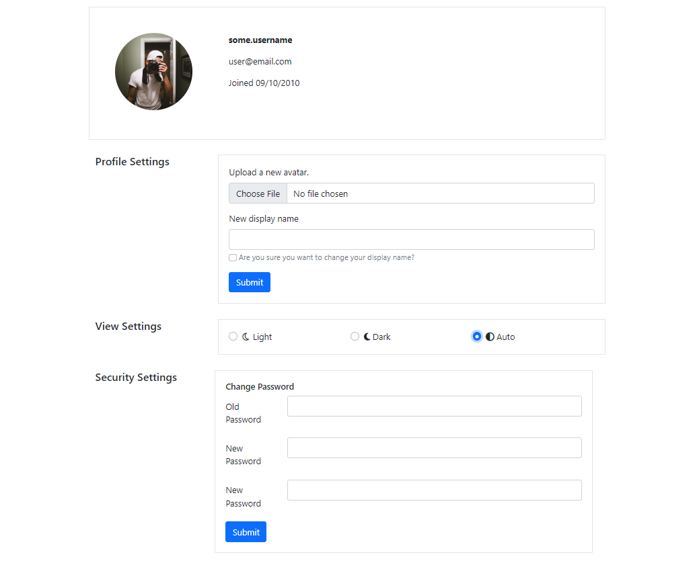

<h1>Daily UI Day 007: User Settings Page</h1>

<p>
These are some user settings for Daily UI's Day 07 challenge for the <a href="https://www.dailyui.co/"> 100 Days of UI 
challenge.</a></p>


## Links

- [Repo](https://github.com/kelseychristensen/Daily-UI-Day-07 "Daily UI Day 07 Repo")
- [Dribbble, Light Mode Snapshot](https://dribbble.com/shots/20017772-Daily-UI-Day-007-User-Settings "Dribbble Link 1")

## Screenshots




## My process

### Built with

- HTML
- CSS
- Bootstrap

### What went into this project

I wrote this user interface, comprised of some of the most important user settings for all kinds of accounts, with Bootstrap and a bit of my own styling. I decided to create another stylesheet for
the "dark mode" settings that this UI can engage to create a dark mode interface. I don't usually spend much time creating responsive interfaces for these challenges, but I did make this one have some styling specifically for large screen widths. 

### What I learned

Very simple, but this was my first time using radio buttons. 

### Continued development

I spent a little time trying to code this up with Flask and Python so the radio button would actually determine which stylesheet is served up. I had some trouble with this, however, because I couldn't figure out how to push the selected radio to the flask server without also adding some sort of submit button and making it a "post" request. I'd like to learn more about how websites engage things like "dark mode" in their sites.
```html
                <div class="form-check">
                  <input class="form-check-input" type="radio" name="flexRadioDefault" id="flexRadioDefault1">
                  <label class="form-check-label" for="flexRadioDefault1">
                    <i class="fa-regular fa-moon"></i> Light
                  </label>
                </div>
```
```css
@media only screen and (min-width: 1400px) {
  .container {
      width: 40%;
  }
}
```
## Author

Kelsey Christensen

- [Profile](https://github.com/kelseychristensen "Kelsey Christensen")
- [Email](mailto:kelsey.c.christensen@gmail.com?subject=Hi "Hi!")
- [Dribble](https://dribbble.com/kelseychristensen "Hi!")
- [Website](http://kelseychristensen.com/ "Welcome")
